# 京东外卖定时优惠券抢券助手 — Code Wiki

> 版本：v1.0.31 | 最后更新：2026-06-03

本文档是项目的完整技术参考，涵盖架构、模块实现、技术难点和关键设计决策，供后续复盘和维护使用。

---

## 目录

1. [项目概述](#一项目概述)
2. [目录结构](#二目录结构)
3. [整体架构](#三整体架构)
4. [核心模块详解](#四核心模块详解)
5. [前端实现细节](#五前端实现细节)
6. [配置系统](#六配置系统)
7. [安全设计](#七安全设计)
8. [打包部署](#八打包部署)
9. [依赖清单](#九依赖清单)
10. [技术难点与关键实现](#十技术难点与关键实现)
11. [版本历史](#十一版本历史)

---

## 一、项目概述

**项目定位**：运行于 Windows 本地的 Python 桌面工具，通过 Playwright 浏览器自动化在京东外卖（hour.jd.com）平台定时自动抢领优惠券。

**核心能力**：

- 按 cron 表达式定时触发，精确到分钟，在开抢前完成页面预热
- Playwright 控制 Microsoft Edge，模拟移动端真实用户操作，内置反检测
- Cookie 加密存储（Fernet），首次扫码登录后长期有效，自动续期
- 内置 Flask Web 管理界面，在线配置、启停任务、查看日志与结果
- 系统托盘图标（pystray），后台静默运行，无终端窗口
- 闲时找券：非定点时段按固定节拍巡检，捡漏临时放出的券
- QQ 邮箱通知：每次任务完成后自动发送结果邮件

**技术栈一览**：

| 层次 | 技术 |
|------|------|
| 浏览器自动化 | Playwright (sync API) + Microsoft Edge |
| Web 框架 | Flask 3 + Waitress WSGI |
| 配置校验 | Pydantic v2 + PyYAML |
| 凭证加密 | cryptography.fernet (AES-128-CBC + HMAC) |
| 定时调度 | 自定义 while 循环（worker），APScheduler 仅用于 cron 校验 |
| 系统托盘 | pystray + Pillow |
| 邮件通知 | smtplib SMTP_SSL (QQ 邮箱 smtp.qq.com:465) |
| 打包 | PyInstaller (单 exe，console=False) |
| 前端 | 原生 HTML/CSS/JS，无框架依赖 |


---

## 二、目录结构

```
jd-coupon-auto-claim/
├── main.py                  # 主入口：系统托盘 + Flask Web 服务
├── worker.py                # 抢券工作进程（由主进程 subprocess 启动）
├── login.py                 # 独立登录工具（打开浏览器扫码，保存 Cookie）
├── web_app.py               # Web 独立入口（无托盘，WEB_PORT/CONFIG_PATH 环境变量）
├── config.yaml              # 用户配置文件
├── config.example.yaml      # 配置示例
├── build.spec               # PyInstaller 打包配置
├── bump_version.py          # 版本号自动递增脚本
├── clean_dist_config.py     # 打包后清理敏感文件脚本
├── make_zip.py              # 打包 zip 发布脚本
├── requirements.txt         # Python 依赖
│
├── src/                     # 核心业务逻辑
│   ├── version.py           # 版本号（当前 1.0.31）
│   ├── models.py            # Pydantic 配置模型 + 运行时数据类
│   ├── config_loader.py     # 配置加载与 Pydantic 校验
│   ├── auth_manager.py      # 登录凭证加密管理
│   ├── coupon_crawler.py    # Playwright 浏览器自动化（抢券 + 闲时巡检）
│   ├── task_runner.py       # 单次任务编排器（7 步流程）
│   ├── scheduler.py         # APScheduler 封装（仅用于 cron 校验）
│   ├── logger_setup.py      # 日志初始化（RotatingFileHandler）
│   ├── email_notifier.py    # QQ 邮箱通知
│   └── web/
│       ├── app.py               # Flask 应用工厂
│       ├── auth_middleware.py   # Basic Auth 中间件
│       ├── config_api.py        # GET/POST /api/config
│       ├── scheduler_controller.py  # 子进程管理 + 调度控制 API
│       ├── log_reader.py        # GET/DELETE /api/logs
│       ├── result_api.py        # GET /api/result
│       └── result_writer.py     # 领券结果写入器（保留最近 50 条历史）
│
├── static/                  # Web 前端静态文件
│   ├── index.html           # 管理界面 HTML（双 Tab）
│   ├── app.js               # 前端逻辑（纯原生 JS）
│   ├── style.css            # 样式（无框架）
│   └── logo.ico/png/jpg     # 应用图标
│
├── data/                    # 运行时数据（.gitignore 排除敏感文件）
│   ├── credentials.enc      # 加密存储的 Cookie
│   ├── fernet.key           # Fernet 加密密钥
│   ├── last_result.json     # 最近领券结果（含历史记录）
│   └── .stop_worker         # 优雅退出标志文件（临时，由主进程创建）
│
└── logs/
    └── app.log              # 运行日志（自动滚动，默认 10MB × 7 份）
```


---

## 三、整体架构

### 3.1 双进程模型

项目采用严格的双进程架构，这是整个设计中最核心的决策：

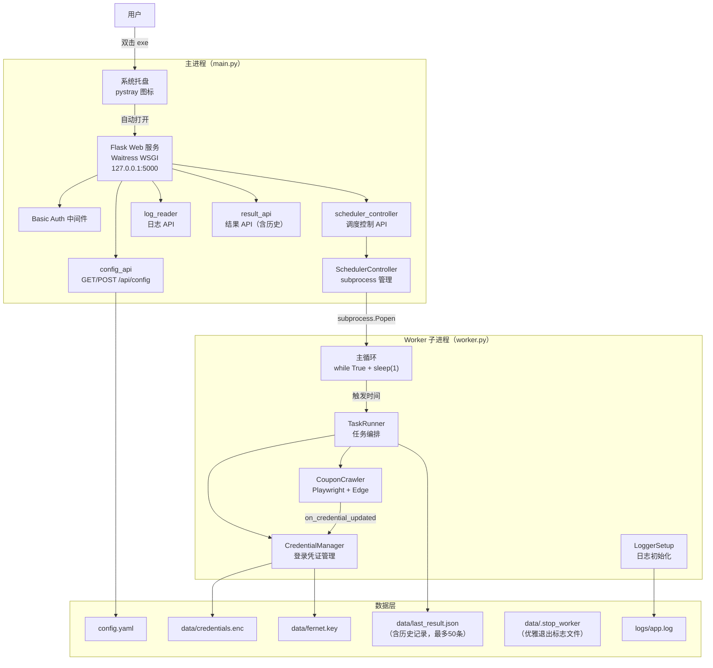

**为什么要双进程？**  
Playwright 的 `sync_api` 基于 greenlet，必须在同一线程内操作 browser/page 对象，不能跨线程调用。Flask 的 Waitress 是多线程 WSGI，如果把 Playwright 放在主进程的线程池里运行，会立即触发 `greenlet.error: cannot switch to a different thread`。双进程彻底隔离，worker 的主线程全权负责 Playwright。

**进程间通信：标志文件模式**  
不使用 socket/pipe/queue，主进程通过创建 `data/.stop_worker` 文件通知 worker 退出：
- 写入：`SchedulerController.stop()` 或 `stop_immediately()` 创建该文件
- 检测：worker 主循环每秒 `os.path.exists()` 轮询
- 清理：worker 检测到后删除文件并退出；`stop()` 的 finally 块兜底删除

优点：无需 IPC 通道，打包成 exe 后完全一样有效。

### 3.2 数据模型

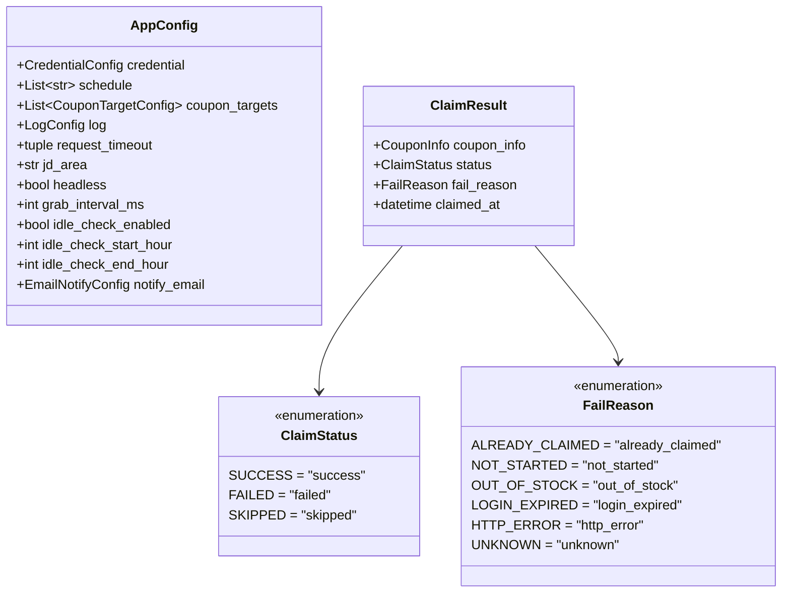

**last_result.json 完整格式（schema_version=2）**：

```json
{
  "schema_version": 2,
  "latest": {
    "schema_version": 1,
    "executed_at": "2026-05-29T10:30:05.123456",
    "summary": { "total": 1, "success": 1, "failed": 0, "skipped": 0 },
    "items": [
      {
        "coupon_id": "grab_0",
        "name": "百补好运券",
        "denomination": 4.0,
        "min_spend": 5.0,
        "status": "success",
        "fail_reason": null,
        "claimed_at": "2026-05-29T10:30:05.456789"
      }
    ]
  },
  "history": [...]
}
```

历史记录最多保留 50 条，最新在前。兼容旧格式（schema_version=1 单条记录）自动迁移。

### 3.3 组件依赖关系

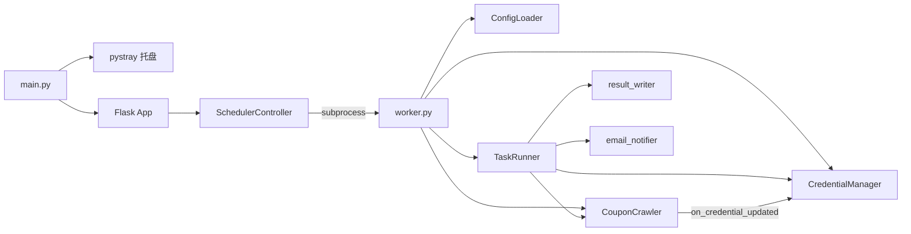

### 3.4 完整运行流程

**启动阶段**

1. 双击 exe → `main.py` 启动
2. 后台线程启动 Flask + Waitress（端口 5000）
3. 主线程启动 pystray 系统托盘（阻塞），自动打开浏览器访问管理界面

**启动任务阶段**

1. 用户点「启动任务」→ POST `/api/scheduler/start`
2. `SchedulerController.start()` → `subprocess.Popen` 启动 worker
3. worker 加载配置，初始化 `CredentialManager`、`CouponCrawler`
4. 三道关卡检查 stop_flag（见难点 10.3），通过后调用 `_ensure_browser()`
5. Edge 启动，移动端上下文，注入反检测脚本 + Cookie
6. 若检测到登录页，等用户扫码（最多 5 分钟），自动提取并加密保存凭证
7. 浏览器就绪，进入 `while True` 主循环，每秒检测触发时间

**抢券阶段**（以 `29 10 * * *` 为例，T = 10:29）

| 时间 | 动作 |
|------|------|
| T:00 ~ T:30 | 等待，每 5s 一次 |
| T:30 | `page.goto()` 打开活动页面（预备） |
| T:49~51（随机一次） | `page.reload()` 预热刷新 |
| T:55 | 开始正式轮询 |
| 每轮 | `page.reload(wait_until="commit")` + 监听 `hours_home_pub` 接口（超时 1500ms） |
| 发现按钮 | 随机间隔（200~500ms）连点 3 次 |
| T+1:06 起 | 检测「已领取」→ 成功；「已抢光/库存不足」→ 失败 |
| T+1:25 | 停止轮询，`crawler.run()` 返回结果 |

`crawler.run()` 返回后，`TaskRunner` 负责写入结果文件并发邮件通知（若已配置）。

**任务执行时序**：

```mermaid
sequenceDiagram
participant Loop as "主循环"
participant TR as "TaskRunner"
participant AM as "CredentialManager"
participant CR as "CouponCrawler"
participant RW as "result_writer"
participant EN as "email_notifier"

Loop->>TR : run()
TR->>AM : is_valid()
alt 凭证有效
TR->>AM : get_headers()
TR->>CR : set_session_cookie(session_cookie)
TR->>CR : run(force=False)
Note over CR : 触发分钟:30 预备，:50 预热刷新（正负随机1000ms）<br/>:55 开始刷新，发现「立即抢券」连点 3 次<br/>开抢分钟:25 结束
CR-->>TR : results
TR->>RW : write_result(results, task_time)
Note over RW : 原子写入，保留最近 50 条历史
TR->>EN : send_result_email()（若已配置）
else 凭证失效
TR->>TR : 记录凭证失效日志
end
```

**浏览器自动化流程**：

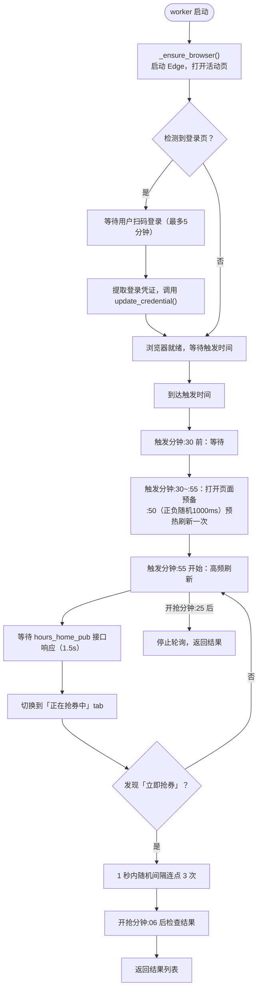

**停止任务阶段**

1. 用户点「停止任务」→ `SchedulerController.stop()` 写入 stop_flag
2. worker 主循环检测到，标记 `crawler._stopped = True`，删除标志文件
3. `crawler.close()`：先 `page.goto("about:blank")` 再关闭 context/browser/playwright
4. 主进程等待最多 15 秒，超时强制 kill


---

## 四、核心模块详解

### 4.1 main.py — 主入口

| 函数 | 职责 |
|------|------|
| `main()` | 解析 CLI 参数，分发到 worker 模式或托盘模式 |
| `_start_web_server()` | 后台线程启动 Flask + Waitress，监听 127.0.0.1:port |
| `_run_tray()` | 启动 pystray 托盘，含「打开管理界面」和「退出」菜单 |

**托盘图标生成逻辑**：优先读 `static/logo.png`，找不到则用 Pillow 绘制红色圆形 + "JD" 文字作为兜底。

**退出逻辑**：托盘「退出」调用 `controller.stop_immediately()`（写 flag + 等 2s + 强杀），然后 `os._exit(0)` 强制终止，避免 Waitress/pystray 的残留线程造成僵尸进程。

**打包兼容**：`_get_worker_cmd()` 通过 `getattr(sys, "frozen", False)` 判断是否为打包环境，打包后用 `sys.executable --worker` 让 exe 以 worker 模式再次启动自己。

---

### 4.2 worker.py — 抢券工作进程

**调度实现**：不使用 APScheduler，用最简单的 `while True + time.sleep(1)` 主循环，每秒调用 `_should_trigger()` 比较当前时间与 cron 中的分钟/小时。同一分钟内用 `trigger_key`（`YYYY-MM-DD HH:MM` 字符串）防重复触发。

**`_should_trigger()` 实现**：

```python
def _should_trigger(schedule, last_trigger_key):
    now = datetime.now()
    for cron in schedule:
        parts = cron.strip().split()
        minute = int(parts[0])
        hour = int(parts[1]) if parts[1] != '*' else -1
        if now.minute == minute and (hour == -1 or now.hour == hour):
            key = now.strftime(f"%Y-%m-%d %H:{minute:02d}")
            if key != last_trigger_key:
                return True, key
    return False, last_trigger_key
```

只解析 cron 的第1字段（分钟）和第2字段（小时），不支持 `*/5`、范围等复杂语法。

**Worker 启动时序**：

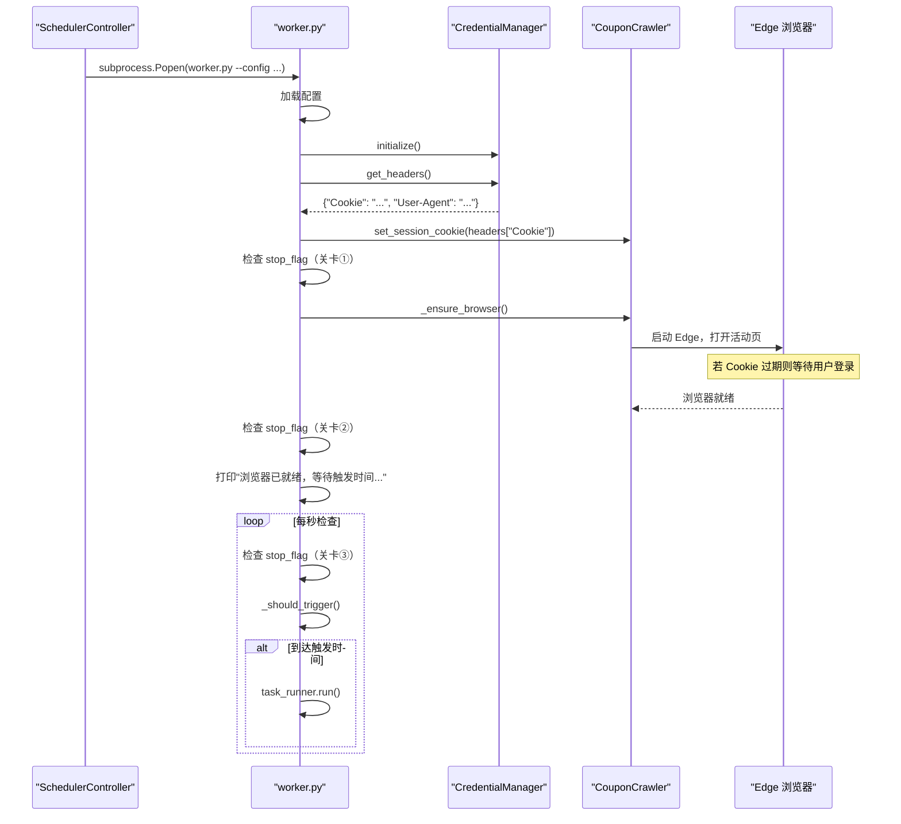

**三道关卡防竞态**（浏览器启动前）：
1. 初始化完成后、`_ensure_browser()` 前检查 stop_flag
2. 浏览器启动完成后再次检查 stop_flag
3. 主循环每秒检查 stop_flag

**闲时巡检调度**（见难点 10.5）：
- 固定节拍：每小时的 `:01/:06/:11/.../56`（每 5 分钟一次）
- 每个节拍加 `±60s` 随机偏移，防固定频率被识别
- 处于定点抢券忙时窗口（触发分 `:25` ~ 开抢分 `:30`）时自动跳过

**运行模式**：
- 默认：等待 cron 时间点触发
- `--once`：`force=True` 执行一次后 `sys.exit(0)`
- `--run-now`：执行一次后继续主循环

---

### 4.3 src/auth_manager.py — 凭证管理

**加密方案**：`cryptography.fernet.Fernet`（AES-128-CBC + HMAC-SHA256），密钥和密文分两个文件存储。

**类结构**：

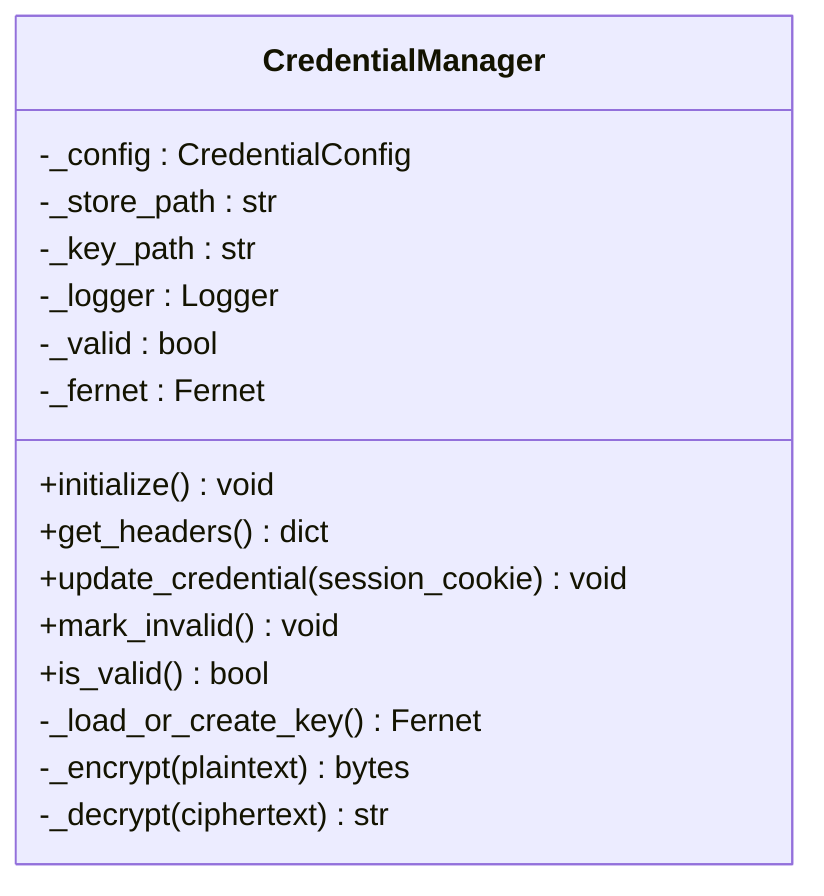

**初始化策略**：

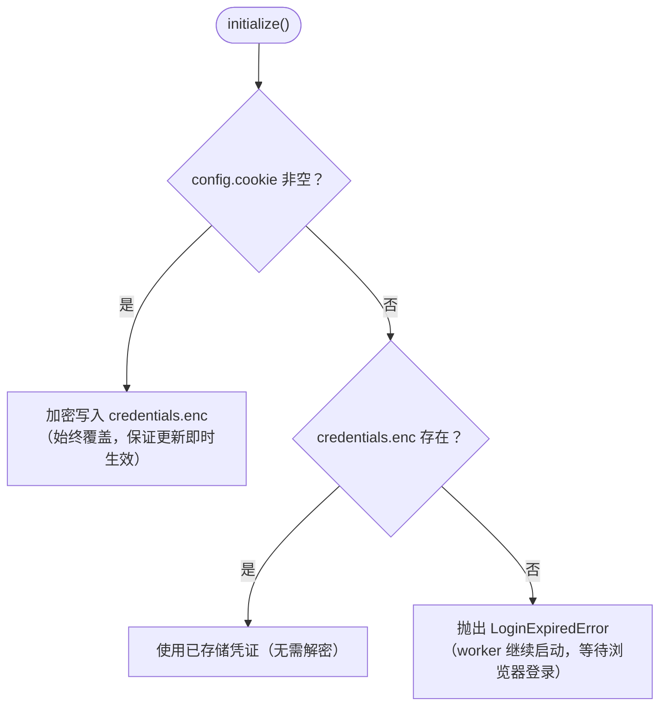

**凭证流转时序**：

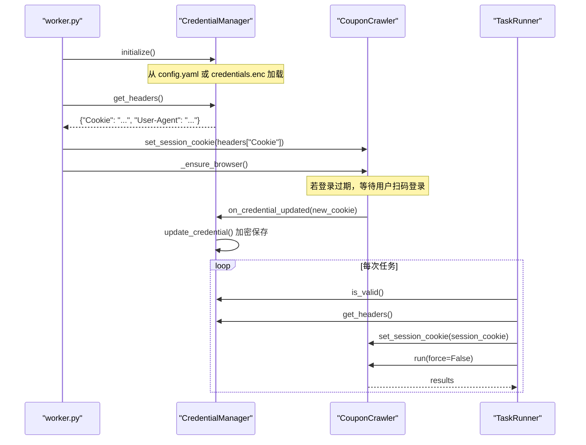

| 方法 | 说明 |
|------|------|
| `_load_or_create_key()` | 首次运行自动生成密钥写入 `data/fernet.key` |
| `initialize()` | config.yaml 有 cookie → 覆盖写入加密文件；config 无 cookie + 加密文件存在 → 直接使用；两者都无 → 抛 `LoginExpiredError` |
| `get_headers()` | 从加密文件解密 Cookie，组装含 UA 的请求头，日志中不记录明文 |
| `update_credential()` | 浏览器扫码登录后回调，覆盖写入新 Cookie，设 `_valid = True` |
| `mark_invalid()` / `is_valid()` | 内存中的 `_valid` 标志，失效后拒绝 `get_headers()` |

**凭证双轨设计**：config.yaml 里的 cookie 字段仅作为"初始导入通道"，每次 `initialize()` 时若 config 有值就覆盖加密文件，然后程序运行后 cookie 始终从 `credentials.enc` 读取，Web 界面保存配置时始终写入空 cookie，不暴露凭证。

**为什么用 Fernet 而不是直接用 AES**：Fernet = AES-128-CBC + HMAC-SHA256 + 时间戳，是"经过认证的加密"（AEAD）。解密前会验证 HMAC，防止密文被篡改；一个 `Fernet.encrypt/decrypt` 调用完成，不需要手动处理 IV/padding，相比手动用 `pycryptodome` 做 AES-CBC 更难出安全错误。

**密钥文件与凭证文件分离**：单独泄露任意一个文件都无法解密，两个都泄露才危险。实际安全价值在于防止日志、配置文件误传时顺带泄露 Cookie 明文。

---

### 4.4 src/coupon_crawler.py — 领券执行器

**完整方法列表**：

```
CouponCrawler
├── set_session_cookie(session_cookie)      更新注入浏览器的 Cookie
├── _ensure_browser()                       启动/复用浏览器
├── _wait_for_login_if_needed(page, url)    检测并等待登录
├── _extract_cookie_from_browser()          从浏览器提取 Cookie
├── warmup()                               兼容接口（仅打印日志）
├── close()                                关闭浏览器
├── run(force=False)                        执行抢券
├── _grab_coupons(page, force=False)        轮询抢券核心逻辑
├── _switch_to_ongoing_tab(page)            切换到「正在抢券中」tab
├── _check_result(page, coupon_info)        判断结果
├── _close_popup(page)                      关闭弹窗
└── idle_check()                           闲时巡检（浏览器未启动则静默跳过）
```

**浏览器生命周期**：

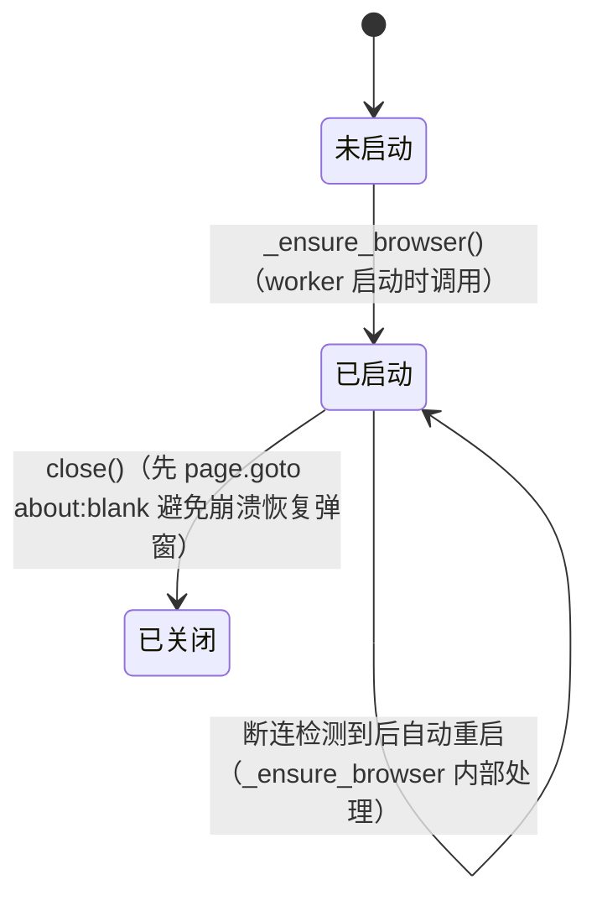

**`_ensure_browser()` 流程**：

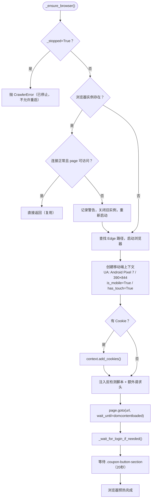

**浏览器内自动登录（`_wait_for_login_if_needed`）**：

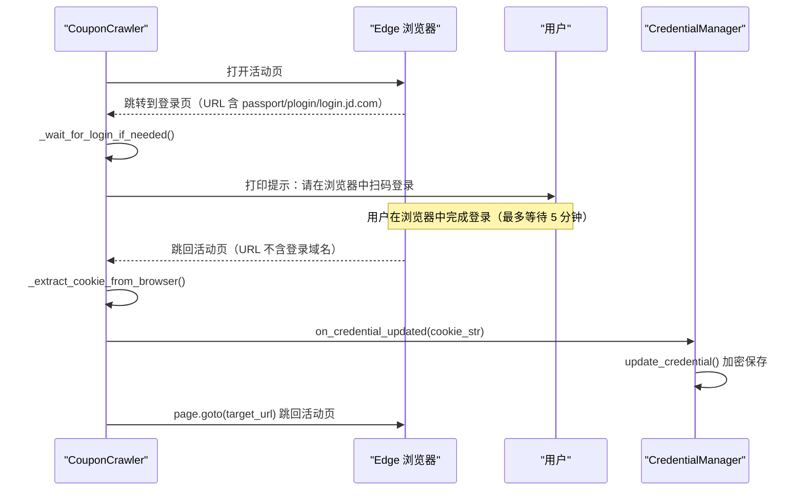

#### 浏览器初始化（`_ensure_browser`）

```
候选路径（按优先级）：
  C:\Program Files (x86)\Microsoft\Edge\Application\msedge.exe
  C:\Program Files\Microsoft\Edge\Application\msedge.exe
  %LOCALAPPDATA%\Microsoft\Edge\Application\msedge.exe  ← 用户级安装
  回退：channel="msedge"（Playwright 自动查找）
```

**上下文配置**：移动端 UA（Pixel 7 Android 13 Chrome 124）、390×844 视口、`is_mobile=True`、`has_touch=True`、`device_scale_factor=3`。

**反检测注入**（`add_init_script`）：
```js
Object.defineProperty(navigator, 'webdriver', { get: () => undefined });
Object.defineProperty(navigator, 'plugins', { get: () => [1, 2, 3] });
window.chrome = { runtime: {} };
```

**额外请求头**：`sec-ch-ua`、`sec-ch-ua-mobile`、`sec-ch-ua-platform`、`Accept-Language`、`Referer`、`Origin`。

#### 抢券核心逻辑（`_grab_coupons`）

**时间窗口动态计算**：根据触发时刻的分钟数自动推算各阶段，适配任意触发时间：

```python
trigger_minute = datetime.now().minute
open_minute    = (trigger_minute + 1) % 60
ready_start    = trigger_minute * 60 + 30   # :30 开始预备
preheat_time   = trigger_minute * 60 + 50   # :50 预热刷新
refresh_start  = trigger_minute * 60 + 55   # :55 开始正式刷新
stop_time      = open_minute    * 60 + 25   # 开抢分钟:25 结束
```

预热时间在任务开始时随机一次（`preheat_trigger = preheat_time ± random(0, 1000ms)`），整个任务过程固定，不每轮重新随机。

**按钮检测与点击流程**：

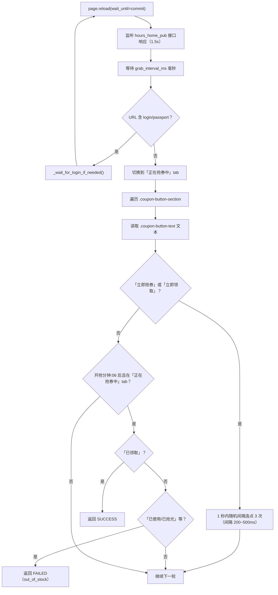

**每轮刷新策略**：
```python
with page.expect_response(
    lambda r: "hours_home_pub" in r.url and r.status == 200,
    timeout=1500
):
    page.reload(wait_until="commit")
if grab_interval_ms > 0:
    page.wait_for_timeout(grab_interval_ms)
```

然后补足随机间隔，保证每轮总时长在 1300~1600ms，防固定频率风控。

**结果判定关键词表**（`_check_result()`）：

| 关键词 | 结果 |
|--------|------|
| `领取成功`、`抢券成功`、`已放入`、`去使用` | SUCCESS |
| `已领取`、`已抢到`、`已使用` | SKIPPED（already_claimed） |
| `已抢完`、`库存不足`、`已售罄`、`已抢光` | FAILED（out_of_stock） |
| `未开始`、`即将开抢`、`待开抢` | FAILED（not_started）→ 继续轮询 |
| `系统繁忙`、`稍后重试`、`网络异常` | FAILED（not_started）→ 继续轮询 |
| 无明确提示 | SUCCESS（默认） |

**风控检测**：「销售火爆」连续出现 8 次（`RISK_CONTROL_THRESHOLD = 8`）才判定风控终止，偶发一两次继续刷，避免误判。

**按钮点击**：发现「立即抢券」/「立即领取」后，1 秒内随机间隔连点 3 次（间隔 200~500ms）。

**结果判定（两条路径）**：
- **主路径（流程图）**：切换到「正在抢券中」tab 后，开抢分钟 `:06` 之后，读取按钮文字——`已领取` → SUCCESS，`已使用/已抢光` 等 → FAILED。这是轮询过程中的实时判定。
- **辅助路径（`_check_result()`）**：点击按钮后等待页面出现结果关键词（见上表），用于补充判断。无论结果如何，`_grab_coupons` 最终以主路径判定为准，`_check_result` 是备用关键词匹配。

#### 闲时巡检（`idle_check`）

轻量版：只 `page.reload()` 一次，监听同一接口，扫描按钮，发现可领取就连点 3 次，无按钮静默返回。不重启浏览器（`_browser is None` 时直接返回）。


---

### 4.5 src/task_runner.py — 任务编排器

七步编排流程图：

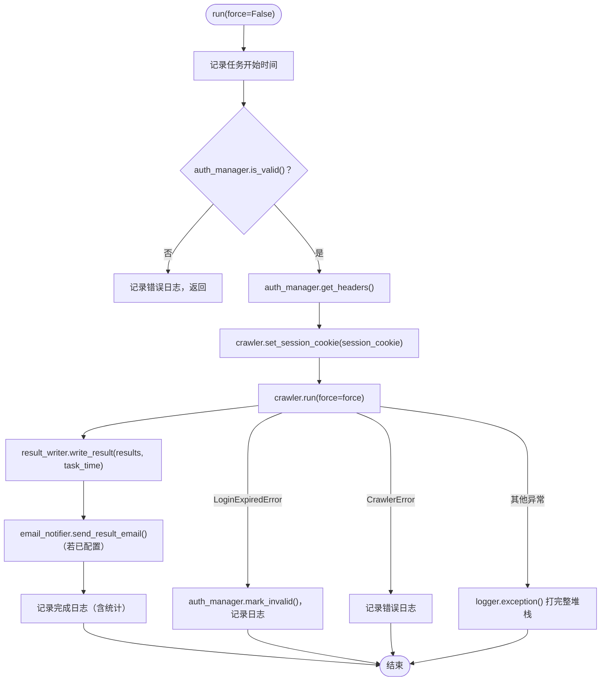

七步编排：

```
① auth_manager.is_valid()          → 检查登录有效性
② auth_manager.get_headers()       → 解密获取 Cookie
③ crawler.set_session_cookie()     → 注入到 Playwright context
④ crawler.run(force)               → 执行领券（返回 ClaimResult[]）
⑤ result_writer.write_result()     → 原子写入 last_result.json
⑥ email_notifier.send_result_email() → 发邮件（若已配置）
⑦ 日志记录完成（成功/失败/已领取 数量）
```

异常分层：`LoginExpiredError` → `mark_invalid()`；`CrawlerError` → 记录错误；其他异常 → `logger.exception()` 打完整堆栈。

---

### 4.6 src/web/ — Web 层

#### app.py — Flask 工厂

```python
app.extensions["scheduler_controller"] = SchedulerController()
```

`SchedulerController` 以单例挂载到 Flask extensions，各 Blueprint 通过 `current_app.extensions["scheduler_controller"]` 获取。

**路由总览**：

| 方法 | 路由 | 功能 |
|------|------|------|
| GET | `/` | 返回 index.html |
| GET | `/static/<path>` | 静态文件 |
| GET | `/api/version` | 版本号 |
| GET/POST | `/api/config` | 读取/保存配置 |
| GET | `/api/scheduler/status` | 调度器运行状态 |
| POST | `/api/scheduler/start` | 启动 worker |
| POST | `/api/scheduler/stop` | 停止 worker |
| POST | `/api/scheduler/run-now` | 立即执行一次 |
| GET | `/api/logs?lines=N` | 读取最新 N 行日志 |
| DELETE | `/api/logs` | 清空日志 |
| GET | `/api/result` | 领券结果 + 历史 |

#### scheduler_controller.py — 子进程管理

**SchedulerController 类结构**：

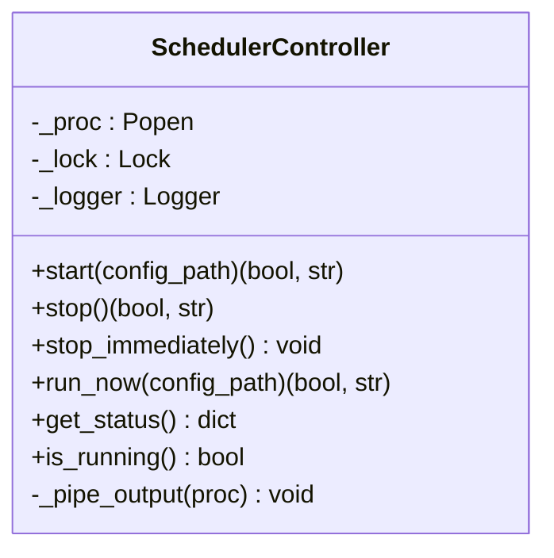

两种停止接口的区别：

| 方法 | 等待时间 | 适用场景 |
|------|----------|----------|
| `stop()` | 最多 15 秒 | Web 界面「停止任务」，给浏览器正常关闭留足时间 |
| `stop_immediately()` | 最多 2 秒 | 托盘「退出」，快速终止，不在意浏览器关闭流程 |

子进程 stdout 由后台线程 `_pipe_output()` 实时转发到主进程日志（加 `[worker]` 前缀），用户在 Web 界面日志区能看到 worker 的所有输出。线程设为 `daemon=True`，主进程退出时自动销毁，不会阻塞退出。

#### auth_middleware.py — Basic Auth

**认证流程**：

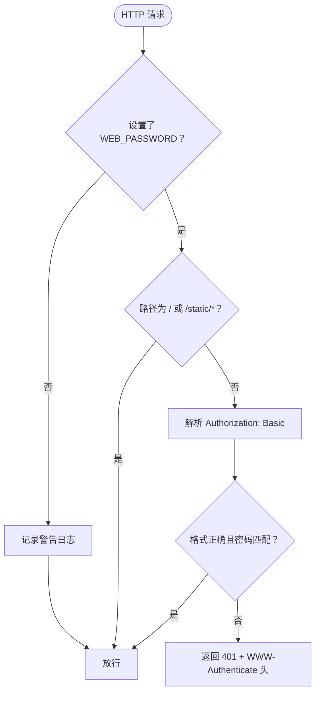

- 通过环境变量 `WEB_PASSWORD` 启用，未设置时放行所有请求
- `/` 和 `/static/` 路径始终放行（防止认证页面本身需要认证）
- 使用 `hmac.compare_digest()` 常量时间比较，防时序攻击

#### config_api.py — 配置 API

**保存时的关键处理**：
1. 用 `CronTrigger.from_crontab()` 校验每个 cron 表达式
2. 校验每个 URL 以 `http://` 或 `https://` 开头
3. `credential.cookie` 始终写空——凭证走 `credentials.enc`，不走 config
4. 若前端传来的 `auth_code` 是掩码 `"••••••••"`，保留原配置里的真实授权码不覆盖
5. `atomic_write_yaml()`：先写 `.tmp` 临时文件，再 `os.replace()` 原子替换，防写入中断损坏

#### log_reader.py — 日志读取

`read_last_lines()` 从文件末尾反向扫描（chunk 8KB），不读整个文件，适合大日志文件的高频轮询：

```python
f.seek(0, 2)          # 定位到文件末尾
remaining = file_size
while remaining > 0 and len(lines_found) <= n:
    read_size = min(8192, remaining)
    remaining -= read_size
    f.seek(remaining)
    chunk = f.read(read_size)
    ...
```

#### result_writer.py — 结果写入

**Schema 版本**：v2 格式包含 `latest`（最新一条）和 `history`（最多 50 条，最新在前）。兼容读取 v1 旧格式（单条记录）自动迁移。

---

### 4.7 src/email_notifier.py — 邮件通知

使用 `smtplib.SMTP_SSL`，连接 QQ 邮箱 SMTP 服务器（`smtp.qq.com:465`），用 QQ 邮箱授权码（非登录密码）认证。

发件人地址由 QQ 号自动拼接：`{qq}@qq.com`。收件人留空则发给自己。

邮件标题根据结果动态生成：`✅ 抢券成功 N 张` / `❌ 未抢到券` / `ℹ️ 无结果`。

---

### 4.8 src/logger_setup.py — 日志系统

`RotatingFileHandler`，默认单文件上限 10MB，保留 7 个备份。格式：

```
%(asctime)s [%(levelname)s] %(name)s: %(message)s
```

同时输出到文件和控制台（`StreamHandler`）。worker 子进程的 stdout 由主进程的 `_pipe_output` 线程捕获，写入同一个 `app.log`，因此日志中 worker 输出带 `[worker]` 前缀。

---

### 4.9 性能考量

| 设计 | 说明 |
|------|------|
| 浏览器常驻 | worker 启动时立即打开浏览器，任务触发时直接复用，无冷启动延迟 |
| 时间窗口动态计算 | 根据触发分钟数自动推算各阶段，适应任意触发时刻 |
| 预热刷新 | 触发分钟:50（±随机1000ms，任务开始时固定一次）预热刷新，提前激活页面缓存，减少正式刷新时延迟 |
| `wait_until="commit"` | 不等整页加载，只等响应头确认，比 `domcontentloaded` 快 200~800ms |
| 随机间隔连点 | 发现按钮后 1 秒内随机间隔连点 3 次（200~500ms），模拟真人，降低风控风险 |
| 原子写入 | config.yaml 和 last_result.json 均用临时文件 + `os.replace()` 原子写入 |
| 日志异步转发 | worker stdout 通过后台 daemon 线程转发，不阻塞主循环 |

---

### 4.10 故障排查

| 症状 | 可能原因 | 解决方法 |
|------|----------|----------|
| 端口被占用 | 5000 端口已有进程 | `python main.py --port 8080` |
| worker 启动失败 | 配置文件错误 | 查看日志 `[worker]` 输出，检查 `config.yaml` |
| 浏览器未弹出 | `headless: true` | 改为 `headless: false` |
| 任务未触发 | cron 格式错误或系统时间不准 | 确认格式 `分 时 * * *`，分和时为具体数字 |
| Cookie 过期 | 登录态失效（约 30 天） | 程序自动弹出浏览器，扫码重新登录；或运行 `python login.py` |
| 密钥文件丢失 | `data/fernet.key` 被删除 | 删除 `data/credentials.enc`，重新登录 |
| 托盘图标不显示 | pystray/Pillow 未安装 | `pip install pystray pillow` |
| 浏览器崩溃后未恢复 | `_ensure_browser()` 检测到断连会自动重启 | 查看日志确认重启情况 |
| 历史记录不显示 | 需要至少执行 2 次任务 | 正常现象，第 2 次起才有历史折叠区 |


---

## 五、前端实现细节

### 5.1 整体结构

`static/index.html` + `static/app.js` + `static/style.css`，纯原生，无 Vue/React/jQuery 依赖。

**双 Tab 布局**：
- **任务控制 Tab**：状态指示灯、启动/停止/立即测试按钮、日志面板、领券结果面板（含历史）
- **配置管理 Tab**：触发时间、活动目标、抢券行为设置（三列 grid）、闲时找券、邮件通知

Tab 切换通过 `display:none/block` 控制，并带 0.15s `fadeIn` 动画。

---

### 5.2 配置页 UI 布局

配置页核心是一个 **CSS Grid 三列布局**，使"活动目标 URL"、"行为设置"三项（弹出浏览器窗口 / 抢券刷新间隔 / 收货地址编码）复用相同列宽，视觉对齐：

```css
.config-grid3 {
  display: grid;
  grid-template-columns: 1fr 1fr 1fr;
  gap: 16px 24px;
  align-items: start;
}
.config-grid3-span2 { grid-column: span 2; }
.config-grid3-span3 { grid-column: span 3; }
```

HTML 结构：
```
config-grid3
  ├── [span2] 优惠券活动 URL 列  (#target-url-col)
  ├── [span1] 备注名称列         (#target-name-col)
  ├── [span3] 分割线 + 小标题
  ├── [span1] 弹出浏览器窗口
  ├── [span1] 抢券刷新间隔
  └── [span1] 收货地址编码
```

URL 和名称分两个独立 `div` 列（`#target-url-col` / `#target-name-col`），`addTargetRow()` 同步向两列各追加一个 input，删除时也同步删除。这样 URL 跨两列、名称占第三列，视觉上形成"宽URL + 短名称"的自然对齐。

---

### 5.3 触发时间选择器

cron 表达式在界面上以"每天 HH:MM 触发"的时间选择器形式展示，不暴露 cron 语法：

```js
// cron → 时间
function cronToTime(expr) {
  const parts = expr.trim().split(/\s+/);
  // "29 10 * * *" → { hour: 10, minute: 29 }
  return { hour: parseInt(parts[1]), minute: parseInt(parts[0]) };
}

// 时间 → cron（保存时转回）
function timeToCron(row) {
  const h = row.querySelector('.cron-hour').value;
  const m = row.querySelector('.cron-minute').value;
  return `${m} ${h} * * *`;
}
```

每行 cron-row 内置两个 `<select>`（小时 0-23、分钟 0-59），样式上隐藏原生 select，通过自定义 `.time-picker` 组件（绝对定位下拉列表）渲染，视觉风格统一。

---

### 5.4 日志面板

日志面板是前端最复杂的部分，涉及多个交互细节：

#### 轮询机制

```js
function pollLogs() {
  setInterval(() => {
    if (state.schedulerRunning) loadLogs();
  }, 3000);
}
```

只在 `state.schedulerRunning === true` 时才发请求。停止任务时主动拉一次最终日志，之后轮询静默。

#### 选区保护（双重检测）

每次 `renderLogs()` 执行两道检测，避免刷新破坏用户正在复制的文字：

**第一道：内容去重**
```js
if (logEl.innerHTML === html) {
  _updateLogBadges(hasWarning, hasError);
  return;  // 内容未变化，跳过 DOM 更新
}
```

**第二道：选区检测**
```js
const sel = window.getSelection();
if (sel && sel.rangeCount > 0 && !sel.isCollapsed) {
  const range = sel.getRangeAt(0);
  if (logEl.contains(range.commonAncestorContainer)) {
    _updateLogBadges(hasWarning, hasError);
    return;  // 用户正在选中日志文字，跳过本次更新
  }
}
```

注意：两道检测都还会调用 `_updateLogBadges()` 更新标题徽章，不因跳过 DOM 更新而遗漏状态变化。

#### 自动滚动控制

```js
const state = { logAutoScroll: true };

function toggleLogScroll() {
  state.logAutoScroll = !state.logAutoScroll;
  // 按钮文字/样式切换：⏸ 暂停滚动 ↔ ▶ 自动滚动
}
```

`renderLogs()` 最后只在 `state.logAutoScroll` 为 true 时才 `scrollTop = scrollHeight`。

#### 警告/错误徽章

遍历日志行，检测含 `ERROR` / `WARNING` 的行，在日志标题旁显示彩色徽章：

```js
const hasError   = lines.some(l => l.includes('ERROR'));
const hasWarning = lines.some(l => l.includes('WARNING') || l.includes('WARN'));
```

```css
.log-badge-warn  { color: #d46b08; background: #fff7e6; border: 1px solid #ffd591; }
.log-badge-error { color: #cf1322; background: #fff1f0; border: 1px solid #ffa39e; }
```

#### 日志行着色

```js
if (line.includes('ERROR'))             return `<span class="log-error">${escaped}</span>`;
else if (line.includes('WARNING') || line.includes('WARN'))
                                        return `<span class="log-warning">${escaped}</span>`;
```

深色背景（`#1e1e2e`）+ 红色/橙色行，视觉区分清晰。

#### 复制日志

优先用 `navigator.clipboard.writeText()`，降级到创建临时 `<textarea>` + `execCommand('copy')`，兼容旧环境。

---

### 5.5 领券结果面板

最新一条结果在面板顶部直接展示（汇总 + 详情表格），历史记录用 `<details>` 折叠展示，从第 2 条开始（第 1 条已在上方展示）：

```js
const older = history.slice(1);
```

每条历史记录内嵌一个可展开的 `<details>`，点开显示该次的详情表格。

`translateFailReason()` 把后端英文枚举值转为中文：`out_of_stock` → `券已抢完`，`login_expired` → `需要重新登录`，支持精确匹配和模糊关键词匹配两种方式。

---

### 5.6 闲时找券开关联动

```js
function _updateIdleTimeRangeVisibility() {
  const enabled = document.getElementById('idle-check-toggle').checked;
  document.getElementById('idle-time-range-group').style.display = enabled ? '' : 'none';
}
```

邮件通知开关同理。两者在 `DOMContentLoaded` 时绑定 `change` 事件，在 `loadConfig()` 后也立即调用一次同步初始状态。

闲时找券的时间段用 `<select>` 选择小时（0-23），`DOMContentLoaded` 时动态生成 24 个 `<option>`，避免 HTML 中硬写。

---

### 5.7 Toast 提示

全局单例，3 秒后自动消失，重复触发时重置计时器：

```js
let _toastTimer = null;
function showToast(message, type = 'info') {
  const toast = document.getElementById('toast');
  toast.textContent = message;
  toast.className = `toast ${type} show`;
  if (_toastTimer) clearTimeout(_toastTimer);
  _toastTimer = setTimeout(() => { toast.className = 'toast'; }, 3000);
}
```

三种类型：`success`（绿）/ `error`（红）/ `info`（蓝），CSS `transition: opacity 0.3s` 淡入淡出。


---

## 六、配置系统

### 6.1 config.yaml 完整字段

```yaml
credential:
  cookie: ''            # 首次运行后可留空，凭证已加密存储在 data/credentials.enc

schedule:
  - '29 10 * * *'       # 每天 10:29 触发（10:30 开抢，提前 1 分钟）
  - '29 11 * * *'
  - '29 16 * * *'
  - '29 17 * * *'

coupon_targets:
  - url: 'https://hour.jd.com/...'
    name: '京东外卖百补好运券'

jd_area: '17_1381_50713_62969'   # 省_市_区_街道，影响可见券范围
headless: false                   # false=弹出窗口，true=后台静默
grab_interval_ms: 300             # 抢券刷新间隔（毫秒），建议 200~2000

idle_check_enabled: false         # 闲时找券开关
idle_check_start_hour: 10         # 巡检开始小时（0~23）
idle_check_end_hour: 18           # 巡检结束小时（0~23）

notify_email:                     # 可选，不填则不发通知
  qq: '123456789'
  auth_code: 'xxxxxxxxxxxx'       # QQ 邮箱授权码（非登录密码）
  receiver: ''                    # 留空则发给自己

log:
  path: 'logs/app.log'
  max_bytes: 10485760             # 10 MB
  backup_count: 7
```

### 6.2 Pydantic 模型（src/models.py）

所有配置字段通过 Pydantic v2 `BaseModel` 定义，使用 `Field()` 声明默认值和描述。校验失败时 `ConfigValidationError` 包含出错字段路径和原因，精确到具体字段。

`AppConfig` 中 `schedule` 和 `coupon_targets` 字段标注 `min_length=1`，确保不能保存空列表。

### 6.3 配置加载流程

```
config.yaml / config.json
    │
    ▼
ConfigLoader.load()
    ├── _detect_format()  →  扩展名判断 yaml/json，其他抛异常
    ├── yaml.safe_load() / json.load()
    ├── 顶层必须是 dict
    └── _validate()  →  AppConfig.model_validate(raw)
                           ├── 成功 → 返回 AppConfig
                           └── ValidationError → 取第一个错误
                                └── 抛 ConfigValidationError(field, message)
```

---

## 七、安全设计

| 措施 | 实现 |
|------|------|
| Cookie 加密存储 | Fernet（AES-128-CBC + HMAC），密钥存独立文件 |
| 密钥自动生成 | 首次运行自动生成 `fernet.key`，不需要手动操作 |
| 凭证失效标记 | `_valid` 内存标志，失效后拒绝使用，等待用户重新登录 |
| 日志脱敏 | Cookie 等敏感值不记录到日志（只记录操作描述） |
| Web 界面认证 | Basic Auth，`WEB_PASSWORD` 环境变量控制，`hmac.compare_digest` 防时序攻击 |
| 静态资源放行 | `/` 和 `/static/` 路径无需认证，防止认证页面本身无法加载 |
| 原子文件写入 | config.yaml 和 last_result.json 均用 `os.replace()` 原子替换，防写入中断损坏 |
| 授权码掩码 | Web 界面返回的 auth_code 替换为 `••••••••`，前端传回掩码时后端保留原值不覆盖 |
| 本地监听 | Flask 只监听 `127.0.0.1`，不对外暴露 |
| 无数据外传 | 程序不向任何第三方服务器发送数据（邮件通知除外，仅发往用户自己的收件箱） |

### 7.1 安全设计深度分析

**为什么用 Fernet 而不是直接用 AES**

Fernet = AES-128-CBC + HMAC-SHA256 + 时间戳，是"经过认证的加密"（AEAD）：
- 解密前验证 HMAC，防止密文被篡改后静默解密出垃圾数据
- 包含时间戳，过期密文可被拒绝（本项目未启用 TTL 校验，但机制在）
- 一个 `Fernet.encrypt/decrypt` 调用搞定，不需手动处理 IV、padding、CBC mode

相比手动用 `pycryptodome` 做 AES-CBC，Fernet 更难出安全错误，是 Python 生态里"傻瓜安全"的标准选择。

**密钥与密文分离存储的意义**

```
data/fernet.key   ← 加密密钥
data/credentials.enc  ← 加密后的 Cookie
```

- 只泄露 `credentials.enc` → 无法解密（缺密钥）
- 只泄露 `fernet.key` → 无法获取凭证（缺密文）
- 两者都泄露才危险 —— 但在本地桌面场景，能访问文件系统的人本来就能操作浏览器

实际价值：防止 `config.yaml` 被用户截图分享、日志上传时顺带泄露 Cookie 明文。

**login.py 重新登录时为何删除旧密钥文件**

旧的 `fernet.key` 如果已泄露，用同一密钥加密新 Cookie 同样不安全。强制删除重新生成，每次登录后都是全新的加密环境：

```python
for f in ["data/credentials.enc", "data/fernet.key"]:
    if os.path.exists(f):
        os.remove(f)
```

**`hmac.compare_digest` 防时序攻击**

普通字符串比较 `password == input` 在字符不匹配时提前返回，攻击者可通过测量响应时间推断密码前几位。`hmac.compare_digest()` 无论内容如何，始终花相同时间完成比较。

**config.yaml 不存储 Cookie 的设计原因**

`config.yaml` 会被用户备份、求助时截图分享。分离后 `config.yaml` 可以安全分享，凭证只在加密文件里。`POST /api/config` 写入时始终强制 `credential.cookie = ""`。

---

## 八、打包部署

### 8.1 build.spec（PyInstaller）

```
入口：[main.py, worker.py]   ← 双入口，worker 以 --worker 参数调用自己
输出：京东外卖定时优惠券抢券助手.exe
图标：static/logo.ico
模式：console=False（无终端窗口）
数据：static/ → static/
排除：numpy/pandas/matplotlib/IPython/jupyter 等大型包（来自 Anaconda 环境）
隐藏导入：waitress/flask/apscheduler/cryptography/playwright/pystray/PIL 等
```

**双入口必要性**：打包后不存在独立的 `python worker.py`，worker 模式通过 `sys.executable --worker` 让 exe 以 worker 模式再次启动自己，`sys.frozen` 标志用于区分源码和打包环境。

### 8.2 打包流程（打包.bat）

```
① bump_version.py     自动递增 src/version.py 的补丁版本号
② 杀掉残留进程（taskkill）
③ 清理 build/ 和 dist/ 旧文件
④ pyinstaller build.spec --clean --noconfirm
⑤ clean_dist_config.py  清理 dist/ 中的敏感文件（data/、logs/）
⑥ 复制并清理 dist/config.yaml（清空 credential.cookie）
```

### 8.3 发布 zip（make_zip.py）

从 `src/version.py` 读取版本号，将 exe + config.yaml + 使用说明.txt 打包进 zip，文件名含版本号。

---

## 九、依赖清单

| 包 | 版本要求 | 用途 |
|----|----------|------|
| `playwright` | >=1.44.0 | 浏览器自动化（worker 进程） |
| `flask` | >=3.0.0 | Web 框架 |
| `waitress` | >=3.0.0 | 生产级 WSGI 服务器（Windows 友好） |
| `apscheduler` | ==3.10.4 | cron 表达式校验（`CronTrigger.from_crontab`） |
| `pydantic` | >=2.7.0 | 配置模型校验 |
| `pyyaml` | >=6.0.0 | YAML 解析 |
| `cryptography` | >=42.0.0 | Fernet 加密 |
| `requests` | >=2.32.0 | HTTP session（worker 初始化用） |
| `pystray` | — | 系统托盘图标 |
| `Pillow` | — | 托盘图标生成/加载 |
| `pytest` | — | 测试框架 |
| `pytest-cov` | — | 覆盖率 |
| `hypothesis` | — | 属性测试 |
| `responses` | — | HTTP Mock |


---

## 十、技术难点与关键实现

这是整个项目最有复盘价值的部分，记录了开发过程中遇到的真实问题和解决思路。

---

### 10.1 Playwright 跨线程限制 → 双进程架构

**问题**：Playwright `sync_api` 使用 greenlet 协程实现同步接口，要求 browser/page 对象必须在创建它们的同一线程内操作。Flask 的 Waitress 是多线程 WSGI，若在 Flask 请求线程中操作 Playwright，会立即报 `greenlet.error: cannot switch to a different thread`。

**方案**：彻底隔离——Playwright 在独立子进程（worker.py）的主线程中运行，Flask 主进程完全不接触 Playwright。两进程通过文件系统标志文件通信。

**教训**：这类"必须在同线程"的库（Playwright sync、tkinter、pystray 等）要在架构设计阶段就考虑进去，不能事后再改。

---

### 10.2 Edge 浏览器路径兼容

**问题**：Edge 有系统级安装（`Program Files (x86)`）和用户级安装（`%LOCALAPPDATA%`）两种路径，Playwright 的 `channel="msedge"` 有时找不到用户级安装的 Edge。

**方案**：手动枚举三个候选路径，找到第一个存在的就用 `executable_path` 显式指定，都找不到再回退到 `channel="msedge"`：

```python
_edge_candidates = [
    r"C:\Program Files (x86)\Microsoft\Edge\Application\msedge.exe",
    r"C:\Program Files\Microsoft\Edge\Application\msedge.exe",
    os.path.expandvars(r"%LOCALAPPDATA%\Microsoft\Edge\Application\msedge.exe"),
]
_edge_exe = next((p for p in _edge_candidates if os.path.exists(p)), None)
```

---

### 10.3 托盘退出时浏览器已弹出的竞态问题

**问题**：用户点托盘「退出」时，worker 可能正好在执行 `_ensure_browser()`（耗时 3~8 秒）。主进程写入 stop_flag 后，worker 还在浏览器启动过程中感知不到，等浏览器弹出来了才被关掉，体验差。

**方案**：三道关卡 + 快速强杀两种机制配合：

```
worker 侧：
  关卡①：_ensure_browser() 调用前检查 stop_flag
  关卡②：_ensure_browser() 返回后检查 stop_flag
  关卡③：主循环每秒检查 stop_flag

主进程侧：
  stop()              等最多 15 秒（Web 界面停止，给浏览器正常关闭时间）
  stop_immediately()  写 flag + 等 2 秒 + 强杀（托盘退出，速度优先）
```

关键细节：`stop_immediately()` 在 `os._exit(0)` 之前调用，确保即使浏览器还在启动也会被杀掉。

---

### 10.4 关闭浏览器触发 Edge 崩溃恢复弹窗

**问题**：直接 `browser.close()` 时，Edge 认为上次"异常退出"，下次启动会弹出"恢复标签页？"的提示框，干扰自动化操作。

**方案**：关闭前先通过 `page.goto("about:blank")` 导航到空白页，让 Edge 认为是正常页面跳转而非崩溃，然后再关闭 context 和 browser：

```python
def close(self):
    self._stopped = True
    try:
        if self._page:
            try:
                self._page.goto("about:blank", timeout=3000)
            except Exception:
                pass
        if self._context:
            self._context.close()
        if self._browser:
            self._browser.close()
        if self._playwright:
            self._playwright.stop()
    except Exception:
        pass
```

关闭后 Edge 不再弹崩溃恢复提示。注意 `context.close()` 前必须先 `page.goto("about:blank")`，否则 Edge 会将 context 关闭视为标签页崩溃。

---

### 10.5 闲时找券的节拍调度设计

**问题**：闲时找券需要每约 5 分钟执行一次，但不能用 APScheduler（Playwright 跨线程限制），也不能用 `time.sleep(300)`（会错过 stop_flag 检测）。

**方案**：在 worker 主循环中基于"节拍时间戳"调度：

```python
# 固定节拍：每小时的 :01/:06/:11/.../:56
_IDLE_BEAT_MINUTES = [1, 6, 11, 16, 21, 26, 31, 36, 41, 46, 51, 56]

# 每次找下一个节拍，加 ±60s 随机偏移，返回 Unix 时间戳
def _next_idle_check_ts() -> float: ...

# 主循环中判断
if idle_check_enabled and time.time() >= next_idle_ts:
    if _is_in_idle_window() and not _is_busy_window(config.schedule):
        crawler.idle_check()
    next_idle_ts = _next_idle_check_ts()
```

**忙时窗口跳过**：触发分钟 `:25` 到开抢分钟 `:30` 期间，`_is_busy_window()` 返回 True，闲时巡检主动跳过，不干扰定点抢券的时间窗口。跨小时边界（如触发分钟=59，开抢分钟=0）时的处理：

```python
trigger_start = minute * 60 + 25
open_end      = ((minute + 1) % 60) * 60 + 30

if open_end < trigger_start:          # 跨小时（如59分触发，0分开抢）
    if cur_seconds >= trigger_start or cur_seconds <= open_end:
        return True
else:
    if trigger_start <= cur_seconds <= open_end:
        return True
```

**随机偏移的意义**：固定 :01/:06 等整分触发容易被平台识别为机器人，±60s 偏移后触发时间在人类正常操作的范围内。对齐到固定节拍而非简单的"每5分钟"，还有一个好处：多次运行的触发时间分布均匀，不会因累积偏移越来越晚。

---

### 10.6 日志面板防刷新破坏选区

**问题**：日志每 3 秒用 `innerHTML` 整体重写，用户划选文字复制时被刷新打断，选区瞬间消失。

**方案**：两道检测（见 5.4），核心代码：

```js
// 第一道：内容未变化，跳过
if (logEl.innerHTML === html) return;

// 第二道：用户正在选中日志内容，跳过
const sel = window.getSelection();
if (sel && sel.rangeCount > 0 && !sel.isCollapsed) {
  const range = sel.getRangeAt(0);
  if (logEl.contains(range.commonAncestorContainer)) return;
}
```

`sel.isCollapsed` 为 `true` 表示光标没有实际选中文字（只是定位），排除这种情况避免误跳过。

`range.commonAncestorContainer` 是选区覆盖范围的共同祖先节点，`logEl.contains()` 判断该节点是否在日志容器内，精确只保护日志区的选区，页面其他地方的选区不影响日志刷新。

---

### 10.7 任务停止后日志停止轮询

**问题**：停止任务后，日志轮询继续每 3 秒拉取，日志框会不停滚动跳到底部，用户无法安静查看最终日志。

**方案**：轮询函数内检查 `state.schedulerRunning`：

```js
function pollLogs() {
  setInterval(() => {
    if (state.schedulerRunning) loadLogs();
  }, 3000);
}
```

停止任务成功后，在 `stopScheduler()` 里主动拉一次最新日志（作为最终快照），之后轮询静默。

---

### 10.8 抢券时序精确控制

**问题**：定时发放的优惠券通常在某分钟的整点瞬间大量并发抢，如果网络稍慢或刷新时机差一点就抢不到，同时过于频繁又容易触发风控。

**关键策略**：

| 策略 | 实现 |
|------|------|
| 提前预热页面 | T:30 提前打开页面，T:50 刷新一次让 CDN 数据预缓存 |
| 监听接口而非等页面完全加载 | `wait_until="commit"` + `expect_response("hours_home_pub", timeout=1500)` |
| 随机化预热时间 | `:50 ± random(0, 1000ms)`，任务开始时固定一次，避免规律被识别 |
| 随机间隔补足 | 每轮目标时长 1300~1600ms 随机，扣掉实际耗时后补足 |
| 连点三次 | 发现按钮后随机间隔（200~500ms）连点 3 次，模拟真人手速 |
| 宽松风控判断 | 「销售火爆」连续 ≥8 次才终止，偶发继续刷，不误判 |

**`wait_until="commit"` 的意义**：Playwright 默认 `wait_until="load"` 要等所有资源（图片、CSS）加载完，`"commit"` 只等响应头确认，页面开始渲染即返回，比 `"load"` 快 200~800ms，在秒级竞争中是关键优势。

---

### 10.9 子进程 stdout 管道转发

**问题**：worker 子进程的 `print()` 输出（调度循环的状态信息）默认只写到子进程自己的 stdout，主进程日志文件看不到，Web 界面日志区也没有。

**方案**：`SchedulerController.start()` 启动子进程时，通过后台 daemon 线程持续读取子进程 stdout，写入主进程的 logger：

```python
def _pipe_output(self, proc: subprocess.Popen) -> None:
    try:
        for line in proc.stdout:
            line = line.rstrip()
            if line:
                self._logger.info("[worker] %s", line)
    except Exception:
        pass

threading.Thread(
    target=self._pipe_output,
    args=(self._proc,),
    daemon=True,      # 主进程退出时自动销毁，不阻塞退出
).start()
```

子进程用 `print(..., flush=True)` 输出确保实时性（不等缓冲区满）。结果就是 Web 界面日志区里能看到 worker 的所有状态行，且带 `[worker]` 前缀与主进程日志区分。

**为什么不用 SIGTERM 替代标志文件**：Windows 下 `proc.terminate()` 实际等同 `TerminateProcess`，是立即强杀，浏览器来不及关闭，触发崩溃恢复弹窗。标志文件让 worker 自己决定何时退出，关闭流程可控。

---

### 10.10 打包后子进程启动兼容

**问题**：源码运行时用 `python worker.py`；打包为 exe 后没有独立的 `python` 解释器和 `worker.py` 文件，直接调用会报错。

**方案**：

```python
def _get_worker_cmd(config_path, run_now=False, once=False):
    if getattr(sys, "frozen", False):  # PyInstaller 打包环境
        cmd = [sys.executable, "--worker", "--config", config_path]
    else:                               # 源码运行
        cmd = [sys.executable, "worker.py", "--config", config_path]
    ...
    return cmd
```

`sys.frozen` 是 PyInstaller 在打包 exe 中注入的标志，`True` 表示当前在打包环境运行，`sys.executable` 此时指向 exe 自身。`main.py` 收到 `--worker` 参数后分发给 `worker.py` 的 `main()` 函数执行。

---

### 10.11 原子文件写入防损坏

**问题**：配置文件或结果文件在写入过程中如果程序崩溃/断电，会产生半写入的损坏文件，下次启动时解析失败。

**方案**：先写临时文件，成功后原子替换：

```python
# config_api.py
fd, tmp_path = tempfile.mkstemp(dir=dir_, suffix=".tmp")
with os.fdopen(fd, "w", encoding="utf-8") as f:
    yaml.dump(data, f, ...)
os.replace(tmp_path, path)  # 原子操作，系统保证不会中途失败

# result_writer.py
with tempfile.NamedTemporaryFile("w", dir=dir_, delete=False, suffix=".tmp") as f:
    json.dump(data, f, ensure_ascii=False, indent=2)
    tmp_path = f.name
os.replace(tmp_path, path)
```

`os.replace()` 在同一文件系统内是原子操作（POSIX rename 语义），Windows 上 Python 3.3+ 同样保证原子性。


---

## 十一、版本历史

| 版本 | 说明 |
|------|------|
| 1.0.0 | 初始发布版本 |
| 1.0.17 | 新增闲时找券、QQ 邮箱通知；结果文件支持历史记录（最多 50 条） |
| 1.0.21 | CODE_WIKI.md 建立；抢券结束时间改为开抢分钟 `:20` |
| 1.0.24 | 修复日志选区被刷新破坏（双重检测）；任务停止后日志停止轮询；修复托盘退出仍弹浏览器的竞态（三道关卡 + `stop_immediately()`） |
| 1.0.28 | 配置页 UI 重构：三列 Grid 布局，触发时间改为时间选择器，URL 和名称分列；新增日志标题徽章（有警告/有错误）；新增暂停滚动和复制日志按钮；停止按钮改为描边样式（`btn-outline-danger`） |
| 1.0.31 | 抢券结束时间从 `:20` 改为 `:25`；配置页三列顺序调整（弹出窗口 → 刷新间隔 → 收货地址）；CODE_WIKI.md 全面重写至当前版本 |

---

*文档维护说明：每次有架构变更、新增功能、技术难点解决时同步更新本文档，重点记录"为什么这么做"而不只是"做了什么"。*
