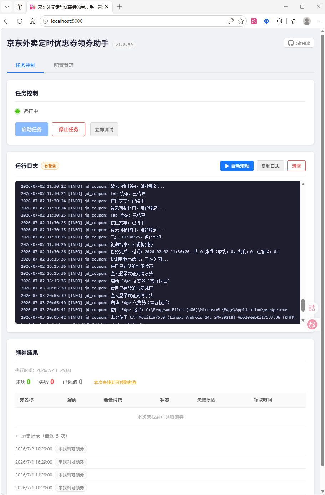

# 京东外卖定时优惠券领券助手

<div align="center">

[]()
[]()
[]()
[]()
[]()
[]()

**基于 Playwright 浏览器自动化的桌面工具 — 定时自动领取京东外卖优惠券，无需守在电脑旁**

</div>

---



---

## 功能

| 功能 | 说明 |
|------|------|
| **定时领券** | 按 cron 表达式精确到分钟触发，支持多个时间点 |
| **自动化操作** | 调用本机 Edge 浏览器，以你的身份登录和领券，与手动操作无异 |
| **登录保持** | 登录状态自动加密保存，首次登录后长期有效 |
| **Web 管理界面** | 内置友好的 Web 界面（Flask），在线配置、启停任务、查看日志与结果 |
| **系统托盘** | 后台安静运行，无终端窗口，托盘图标一键操作 |
| **闲时找券** | 非定点时段自动巡检，捡漏临时放出的可领取券 |
| **邮件通知** | 每次任务完成后自动发送结果到 QQ 邮箱 |

## 快速开始

### 方式一：下载 exe（推荐）

1. 从 [Releases](https://github.com/helloaider/jd-coupon-auto-claim/releases) 下载最新版 zip
2. 解压后双击 `京东外卖定时优惠券领券助手.exe`
3. 系统托盘出现图标，浏览器自动打开管理界面 `http://localhost:5000`
4. 在「配置管理」Tab 填写配置，点击「启动任务」

### 方式二：源码运行

```bash
# 安装依赖
pip install -r requirements.txt
playwright install msedge

# 启动
python main.py
```

首次登录：点「启动任务」后程序弹出 Edge 浏览器，若跳转到登录页，用手机号+验证码或密码完成登录即可，登录状态自动保存。

## 配置说明

在 Web 界面「配置管理」Tab 填写，或直接编辑 `config.yaml`：

| 字段 | 说明 |
|------|------|
| `schedule` | cron 触发时间列表，建议开放领券前 1 分钟，如 `29 10 * * *` |
| `coupon_targets[].url` | 优惠券活动页面 URL |
| `headless` | `false`=弹出浏览器窗口，`true`=后台静默 |
| `grab_interval_ms` | 页面刷新间隔（毫秒），建议 100~2000 |
| `idle_check_enabled` | 是否开启闲时找券（默认 false） |
| `idle_check_start_hour` | 闲时巡检开始小时（默认 10） |
| `idle_check_end_hour` | 闲时巡检结束小时（默认 18） |
| `notify_email.qq` | QQ 号，启用邮件通知 |
| `notify_email.auth_code` | QQ 邮箱授权码（非登录密码） |
| `notify_email.receiver` | 收件人邮箱，留空则发给自己 |

## 运行流程

### 启动

1. 双击 exe，主进程启动 Web 服务（端口 5000）并显示系统托盘图标
2. 自动打开浏览器访问管理界面

### 启动任务

1. 用户点「启动任务」，主进程启动独立工作进程（`worker.py`）
2. worker 加载配置、初始化凭证、自动查找并启动 Edge 浏览器
3. 若检测到跳转登录页，等待用户在浏览器中手动登录，登录成功后自动提取并加密保存凭证
4. 浏览器就绪后进入主循环，每秒检测 cron 触发时间

### 领券时间线（以 `29 10 * * *` 为例，T = 10:29）

| 时间 | 动作 |
|------|------|
| T:00 ~ T:30 | 等待阶段，每 5 秒检测一次 |
| T:30 | 打开活动页面 |
| T:49~51（随机） | 预热刷新，让数据提前加载 |
| T:55 | 开始定时刷新（每轮 1.3~1.6s 随机间隔） |
| T:55 ~ T+1:25 | 检测按钮并点击；T+0:06 起检测领券结果 |
| T+1:25 | 停止刷新，结果写入 `data/last_result.json` |

### 闲时找券

开启 `idle_check_enabled` 后，非定点时段按固定节拍自动刷新检测是否有可领取券。每次触发在节拍分钟 1 分钟内随机，处于领券窗口时自动跳过。

### 停止任务

1. 主进程写入停止标志文件
2. worker 检测到后关闭浏览器并退出
3. 主进程等待最多 15 秒，超时则强制结束

### 测试效果

点「测试效果」启动临时 worker（`--once` 模式），跳过时间窗口，最多刷新 20 次后自动退出，不影响正在运行的调度器。

## 系统要求

- Windows 10 或更高版本
- Microsoft Edge 浏览器（Windows 默认自带）
- Python 3.10+（源码运行）或直接使用打包好的 exe

## 常用命令

```bash
# 独立登录工具（重新登录）
python login.py

# 临时测试（立即执行一次，跳过时间窗口）
python worker.py --once

# 打包 exe
pip install pyinstaller playwright
pyinstaller build.spec
python make_zip.py
```

## 项目结构

```
src/
├── auth_manager.py      # 登录状态加密管理
├── config_loader.py     # 配置加载与校验
├── coupon_crawler.py    # Playwright 浏览器自动化（含闲时找券）
├── email_notifier.py    # QQ 邮箱通知
├── task_runner.py       # 任务编排器
├── scheduler.py         # APScheduler 封装（cron 校验）
├── logger_setup.py      # 日志初始化
├── models.py            # Pydantic 数据模型
└── web/                 # Flask Web 管理界面
```

## 安全说明

- 登录状态加密保存在本机，使用 Fernet（AES-128-CBC + HMAC），密钥独立存放
- Web 界面默认只监听 `127.0.0.1`，不对外暴露
- 可通过 `WEB_PASSWORD` 环境变量启用 Basic Auth
- 邮件授权码在 Web 界面以掩码显示，不以明文返回

## 隐私说明

**本程序不会收集或上传任何个人数据。** 程序调用你电脑上已安装的 Microsoft Edge 浏览器，以你的身份在浏览器中完成登录和领券操作，与你本人手动操作浏览器没有本质区别。

- 登录凭证仅保存在本机，使用 AES-128 对称加密存储
- 程序运行期间不向任何第三方服务器发送数据（邮件通知除外，仅把领券结果发往你填写的收件箱）
- 所有日志和结果文件均保存在本机，不上传

## 免责声明

本工具仅供学习研究使用，请勿用于任何商业或违法用途。使用本工具产生的任何后果由使用者自行承担，与本项目无关。建议仅用于个人正常使用频率内的领券，不建议批量或异常频率操作。

## License

MIT
